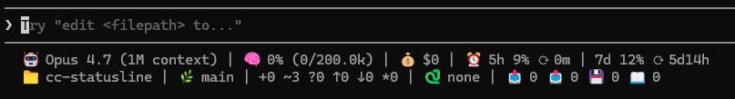

# cc-statusline

A two-line PowerShell statusline for [Claude Code](https://claude.com/claude-code) on Windows.
Shows model, project, context usage, session cost, **5-hour & weekly subscription quota with reset countdown**, plus git / venv / token stats.

中文版：[README.zh-TW.md](README.zh-TW.md)

## Preview



## Features

### 1. 🤖 Model name

Pulls `model.display_name` from Claude Code's stdin payload (e.g. `Opus 4.7`, `Sonnet 4.6`, `Haiku 4.5`). Falls back to `Claude` if the field is missing — useful when you switch model mid-session and want a quick glance to confirm the change took effect.

Example output: `🤖 Opus 4.7`

### 2. 📁 Project name

Reads `workspace.project_dir` from stdin and shows just the leaf folder name (not the full path, to keep the line short). If the field is missing, falls back to the current working directory. Helps when you're juggling multiple Claude Code windows on different projects. Rendered at the **start of line 2** so it stays visible even when the terminal is narrow and line 1 gets truncated.

Example output: `📁 my-project`

### 3. 🧠 Context window usage

Reads the running session transcript (`transcript_path` from Claude Code's stdin payload), grabs the **last** message's `usage` block, and computes:

```
context_used = input_tokens + cache_creation_input_tokens + cache_read_input_tokens
context_pct  = context_used / 200000 * 100
```

The default ceiling is 200,000 tokens (standard Sonnet / Opus). Bump it to `1000000` in `statusline.ps1` if you're on the 1M-context Opus tier.

Example output: `🧠 12% (24.0k/200.0k)`

### 4. 💰 Session cost

Pulls `cost.total_cost_usd` straight from the JSON Claude Code passes in. Rounded to 4 decimals so you can see costs accumulating in real time without the number going to scientific notation early in the session.

Example output: `💰 $0.1234`

### 5. ⏰ Real 5-hour & 7-day subscription quota

Shows the **exact same numbers** as the `/status` slash command inside the Claude Code TUI — current utilization percentage plus a countdown (`⟳`) to the next reset. No estimation, no token-counting heuristic; the numbers come directly from Anthropic's OAuth `usage` endpoint, so they always match what `/status` reports.

Example output: `⏰ 5h 6% ⟳ 11m | 7d 2% ⟳ 6d16h`

### 6. 🌿 Git status

If the project directory is a git repo, runs a few lightweight commands (`rev-parse`, `status --porcelain`, `rev-list ...@{upstream}`, `stash list`) and shows:

- Branch name
- `+N` staged files
- `~N` modified files
- `?N` untracked files
- `↑N` commits ahead of upstream
- `↓N` commits behind upstream
- `*N` stash count

Example output: `🌿 main | +0 ~2 ?1 ↑0 ↓0 *0`

If the project dir isn't a repo, you get `🌿 (no repo)` instead — no error noise.

### 7. 🐍 Python venv detection

Reads `$env:VIRTUAL_ENV` first, then falls back to `$env:CONDA_DEFAULT_ENV`. Shows the env name (just the leaf folder), or `🐍 none` if neither is active. Lets you spot at a glance whether Claude Code inherited the venv you expected.

### 8. 📥 📤 💾 📖 Cumulative session token totals

While reading the transcript for context %, the script also **sums every** `usage` block in the file, giving you a running total of how many tokens this session has burned in each category:

- 📥 input tokens
- 📤 output tokens
- 💾 cache-creation tokens
- 📖 cache-read tokens

Useful for spotting sessions that are accidentally re-uploading huge files instead of hitting the cache.

### 9. Non-blocking background refresh

The statusline must render in milliseconds — Claude Code re-runs the script on every event. So `statusline.ps1` never makes a network call itself. Instead it reads a local `quota-cache.json` file and, only if the cache is older than 60 seconds, fires off `fetch-quota.ps1` as a hidden background process. The current render uses whatever the cache already has; the next render picks up the fresh value. Result: statusline stays snappy even if the API is slow or down.

### 10. Manual quota override

If the OAuth fetch ever breaks (token expires, endpoint changes, you're on a non-subscription account), `update-quota.ps1` lets you type the numbers in by hand and they'll show up in the statusline same as the auto-fetched ones. See [Manual quota override](#manual-quota-override) below.

## Requirements

- Windows + PowerShell 5.1 (built into Windows) or PowerShell 7+
- Claude Code installed and signed in via the Claude Pro / Max OAuth flow
  (the script reads the OAuth token from `.credentials.json`)
- A terminal with emoji support (Windows Terminal recommended)

## Install

Clone, then run `install.ps1`:

```powershell
git clone https://github.com/<your-username>/cc-statusline.git
cd cc-statusline
powershell -NoProfile -ExecutionPolicy Bypass -File .\install.ps1
```

What it does:
1. Copies `statusline.ps1`, `fetch-quota.ps1`, `update-quota.ps1` to `$env:CLAUDE_CONFIG_DIR` (defaults to `$env:USERPROFILE\.claude`)
2. Merges a `statusLine` block into your `settings.json` (existing keys are preserved)
3. Runs `fetch-quota.ps1` once so the cache is warm before you launch Claude Code

Restart Claude Code afterwards.

### Custom config dir

Targeting a non-default config dir (e.g. a second profile):

```powershell
.\install.ps1 -ConfigDir 'C:\Users\you\.claude-second'
```

### Skip initial fetch

```powershell
.\install.ps1 -NoFetch
```

## How quota works

`fetch-quota.ps1` calls an undocumented OAuth endpoint that the Claude Code TUI itself uses:

```
GET https://api.anthropic.com/api/oauth/usage
Authorization: Bearer <claudeAiOauth.accessToken from .credentials.json>
anthropic-beta: oauth-2025-04-20
```

Response (trimmed):
```json
{
  "five_hour":  { "utilization": 6.0, "resets_at": "2026-05-11T04:50:01Z" },
  "seven_day":  { "utilization": 2.0, "resets_at": "2026-05-17T21:00:01Z" }
}
```

Those values get written to `quota-cache.json` in your Claude config dir. The statusline reads the cache and, if it's older than 60 seconds, kicks off a hidden background `fetch-quota.ps1` so the next render is fresh — without slowing down the current render.

## Customization

| Want to change | File | What to edit |
| --- | --- | --- |
| Cache TTL (default 60s) | `statusline.ps1` | `if ($cacheAge -gt 60)` |
| Context window size (default 200000) | `statusline.ps1` | `$ctxLimit = 200000` (set to `1000000` for 1M Opus) |
| Reset countdown symbol | `statusline.ps1` | The two `⟳` characters in the `$line1` format string |
| Line layout | `statusline.ps1` | The `$line1` / `$line2` format strings |

## Manual quota override

If the OAuth fetch breaks for any reason, you can still type quota numbers in by hand:

```powershell
update-quota -h5 20 -h5r 1h20m -d7 50 -d7r 5d21h
update-quota -h5 35              # update only 5h percentage
update-quota -Show               # show current cached values
update-quota -Clear              # delete the cache file
```

Duration formats: `1h20m`, `5d21h`, `30m`, `90s` (combine `d` / `h` / `m` / `s`).

## Caveats

- The OAuth `usage` endpoint is **not officially documented**. Anthropic could change or remove it without notice — if that happens, `fetch-quota.ps1` silently fails and the statusline falls back to the last cached values (or `--`).
- The script reads your OAuth access token from `.credentials.json`. If your install stores credentials elsewhere (Windows Credential Manager on some setups), you'll need to adapt `fetch-quota.ps1`.
- 5h / 7d quota only applies to Pro / Max subscription users. API-key-only users will see `--`.

## License

MIT — see [LICENSE](LICENSE).
